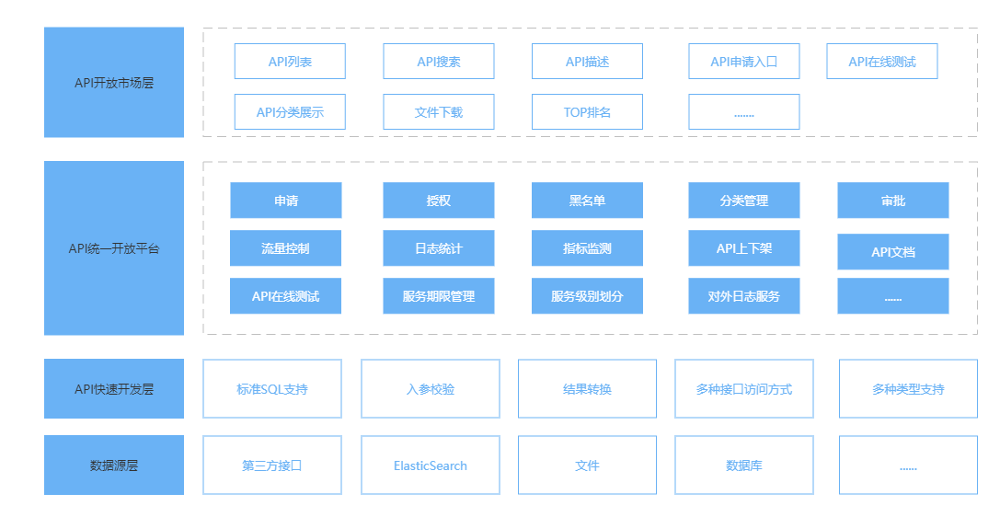

## 整体架构


## 一、整体模块说明
数据开放平台整体分为对外展示端和内部数据开发端，两者共同组成了整个数据开放平台，推动数据开放更加的便捷、快速、安全。
对外展示端：
对外展示端，主要展示目前对外开放的API，以及API的详细对接信息，通过浏览展示的API信息，数据使用方可以来筛选自己所需要的API，进行API的申请，并且根据API的描述信息完成自主对接。

内部数据开发端：
内部数据开发端，主要进行数据的对外开放，通过简单的配置即可完成对数据的开放，开发的数据信息实时显示到对外展示端，轻松完成数据开放的开发功能。

## 二、部署说明
### 1、数据平台部署依赖
该平台目前强依赖于JDK、MySQL，弱依赖于Redis、Nginx。意味着在部署该平台之前必须安装JDK和MySQL，而Redis和Nginx是可选的。

- JDK：推荐使用open-jdk 8
- MySQL：推荐使用MySQL 8.0版本
- Redis：推荐使用最新版本
- Nginx：推荐使用最新版本。
### 2、数据平台部署步骤

1. 解压tar.gz包
```bash
tar -zxf open-data-platform.tar.gz
```

2. 初始化数据库
- 创建数据库：创建一个数据库，并且指定该数据库对应的账号密码，
- 初始化数据库，执行目录下面的sql文件夹下面的open_platform.sql文件。
```bash
source open-data-platform/sql/open_platform.sql
```

3. 修改配置文件，具体修改点如下：
```properties
# 系统访问协议
server.protocol=http 
# 系统启动之后的访问地址
server.address=127.0.0.1
# 系统启动之后的访问端口
server.port=8080


# 钉钉机器人tokenId  如果没有或者无法连接外网，请注释该配置
dingtalk.tokenId=ac30f966fc10bdc51400a14b0343498fa6487bb556b5e3f913ab4b31ae70b4e9
# 钉钉机器人秘钥
dingtalk.secret=SEC410977bee089c554fc05e70154131aab571224b3aaa4422734b155be64c1bd9c

# 邮箱相关 如果没有或者无法连接外网，请注释该配置
# 邮箱host
spring.mail.host=smtp.163.com
# 邮箱端口
spring.mail.port=25
# 邮箱账号
spring.mail.username=1111@163.com
# 邮箱地址
spring.mail.fromAddress=22222@163.com
# 邮箱授权码
spring.mail.password=xxxxxxxxxxx
# 发件人昵称
spring.mail.nickname=xxx

# 数据库地址
spring.datasource.url=jdbc:mysql://127.0.0.1:3306/open_platform?useSSL=false
# 数据库账号
spring.datasource.username=user_name
# 数据库密码
spring.datasource.password=password

# REDIS配置，如不使用Redis请不要配置相关属性
# Redis数据库
spring.redis.database=0
# Redis数据库地址
spring.redis.host=127.0.0.1
# Redis数据库端口
spring.redis.port=6379
# Redis数据库密码
spring.redis.password=password


# 缓存类型，取值范围为[local、redis],如未配置redis，请修改值为local
open.data.platform.base.cache-type=redis
# 是否开启限流
open.data.platform.base.access-limiter-open=false
# 限流类型，取值范围为[local、redis],如未配置redis，请修改值为local
open.data.platform.base.access-limiter-type=redis


# 对外开放API的统一前缀，必须以/开头，不能以/结尾
open.data.platform.base.open-api-base-register-path=/open-api
# 对外开放API的访问地址，必须为完整URL，不能以/结尾
open.data.platform.base.open-api-service-address=http://127.0.0.1:15124


# cookies 的域名
open.data.platform.cookie.domain=127.0.0.1
# cookies 的有效期，单位秒。默认7200s
open.data.platform.cookie.timeout=7200

# 用户登录状态的延期时间，默认1800s，即用户登录剩余30分钟的时候，将其重置为2小时
open.data.platform.user.token.refresh-token-end-time=1800
# 用户登录状态的有效期，默认7200s  即2小时
open.data.platform.user.token.timeout=7200


```

4. 启动
```properties
# 启动必须在根目录下进行
./bin/platform-daemon.sh start
```

5. 查看状态
```properties
./bin/platform-daemon.sh status

# 启动成功状态为
Begin status ......
  [  RUNNING  ]
End status .

# 未启动状态为
Begin status ......
  [  STOP  ]
End status .
```

6. 停止
```properties
# 启动必须在根目录下进行
./bin/platform-daemon.sh stop
```

7. 启动报错日志路径
```properties
tail -n 100 logs/open-data-platform.out
```

## 三、开发人员使用手册
### 1.简易报表
简易报表模块，提供了目前的一些数据统计和分析，具体统计分析数据如下：

- API数量：目前对外的开放的所有API数量，不包括以下下线的API和不开放的API。
- 用户数量：表示目前已经注册并激活并且未被禁用用户数量。
- 订阅数量：表示目前所有用户已经申请的API的数量。
- 调用次数：表示当前对外开放的API被外部调用的次数。
- 成功次数：表示当前对外开放的API被外部调用的次数中成功的次数。
- 失败次数：表示当前对外开放的API被外部调用的次数中失败的次数。
- 请求成功率：请求成功率=(成功次数/调用次数)* 100%.
- 面积图：表示了最近7天的调用次数、成功次数、失败次数的变化趋势。


### 2.用户管理
用户管理模块包含了角色管理和用户管理两个功能，分别管理角色和用户。下面分布说明：
角色管理：
角色管理用于系统的角色相关管理工作。其中admin角色为数据开发者角色，其余角色全为数据使用者角色，普通用户注册之后，会默认赋予数据使用者的角色，赋予的角色取决的当前角色列表中的默认角色。

用户管理：
用户管理用于管理用户信息，包用户的新增和修改、激活等操作。

创建用户的流程如下：

- 新增用户


- 激活用户


- 查询密码（注意：密码只在激活之后10分钟内有效，请在10分钟之内获取）


### 3.数据源管理
数据源管理用于管理数据开放过程中涉及到的数据源，目前支持的数据源有：MYSQL、DB2、ORACLE、PostgreSQL、presto、SQLServer、ClickHouse、StarRocks、Doris、ElasticSearch。

数据源的配置，主需要配置数据源相应的连接信息即可。配置的数据源可以在API开发中被使用。

### 4.开放API管理
开放API管理，目前包含了API分类管理和API管理两个模块。
API分类管理：
API分类管理用于管理API的分类信息，分类信息主要左右有两个方面，一是对API进行分类便于API的筛选与查询，二是用于展示端对API进行归类展示。


API管理：
API管理用于对外开发的API的整个管理流程，其包含了API的整个生命周期的管理，主要功能包括：

- API的基础信息维护：包括API的名称、描述、调用信息、参数信息、返回值信息、状态等。
- API的开发：用于开发具体的API逻辑。
- API的生命周期管理：包括API多环境的上下架、对外申请的管理。


### 5.数据管理
数据管理模块，包含了申请审核和请求日志两个模块。
申请审核：
针对用户的API申请进行审核，可以通过或拒绝，通过之后也可以禁用，禁用之后用户无法在使用该接口。


请求日志：
请求日志信息记录了该平台所有对外开放API的请求日志信息，包括URL、环境、API、用户、状态、响应时长、返回数据量、错误提示、请求时间等信息。


## 四、数据使用者功能说明
### 1.简易报表
简易报表模块，提供了目前的一些数据统计和分析，具体统计分析数据如下：

- 订阅数量：当前用户订阅的API数量。
- 已通过：表示申请已经通过的API数量。
- 待审核：表示申请等待审核的API数量。
- 调用次数：表示当前申请的AP调用的次数。
- 成功次数：表示当前申请的API调用的次数中成功的次数。
- 失败次数：表示当前申请的API调用的次数中失败的次数。
- 请求成功率：请求成功率=(成功次数/调用次数)* 100%.
- 面积图：表示了最近7天的调用次数、成功次数、失败次数的变化趋势。


### 2.数据管理
数据管理包括了：我的秘钥KEY、我申请的接口、请求日志 三部分。
我的秘钥KEY：
我的秘钥KEY中管理用户的唯一身份认证的APPKEY和用于API参数签名的APPSECRET信息。

我申请的接口
其中管理用户当前申请的接口信息，可以查看API的状态和申请状态信息。

请求日志：
请求日志信息记录了该平台所有对外开放API的请求日志信息，包括URL、环境、API、用户、状态、响应时长、返回数据量、错误提示、请求时间等信息。

### 3.签名测试
签名测试用于针对自实现的签名进行测试，用于确定自实现的签名算法的正确性。

## 五、API开发说明
当我们配置完一个API的基础信息之后，就可以开始对应API的开发，在API列表页面点击 “开发”按钮。即可进行API开发页面；下面是对API开发的说明。

### 1.多环境的支持
目前可以同时支持三种环境，分布为test(测试环境)、pre(预发布环境)、prod(生产环境)，可以灵活使用，只要能进行区分就行，多环境数据源的配置，在开发页面的数据源中进行指定。
在该开发页面进行测试时，可以自己指定环境，正式是API调用中通过请求头传递execute-env参数，进行执行环境的确定，不同环境将使用不同的数据源，即完成一个接口支持三个数据源的能力。

### 2.内置函数
为了更好的进行API逻辑的编写，内部内置了一些用于操作数据源的函数，见内置函数说明。
### 3.多种API语法
API的逻辑书写目前支持三种语法，分别为GROOVY、JAVASCRIPT、SQL，三种语法说明如下：
#### SQL
SQL语法支持标准的SQL语句、以及Mybatis语法，返回的值为标准的JSONARRAY格式，Mybatis语法可以参数：[https://mybatis.org/mybatis-3/zh/dynamic-sql.html](https://mybatis.org/mybatis-3/zh/dynamic-sql.html)
标准SQL示例：

Mybatis语句示例：

#### GROOVY
GROOVY通过标准的GROOVY语法进行脚本的编写，通过内置的函数实现脚本中对数据源数据的获取操作，可以使用标准的GROOVY语法对返回值进行操作。groovy语法参考:[https://www.w3cschool.cn/groovy/index.html](https://www.w3cschool.cn/groovy/index.html)


#### JAVASCRTPT
JAVASCRTPT通过标准的JAVASCRTPT语法进行脚本的编写，通过内置的函数实现脚本中对数据源数据的获取操作，可以使用标准的JAVASCRTPT语法对返回值进行操作。JAVASCRTPT语法参考:[https://www.runoob.com/js/js-tutorial.html](https://www.runoob.com/js/js-tutorial.html)

### 4.自定义返回结构
接口的返回格式支持自定义，首先勾选需要进行自定义，然后可以进行自定义，自定义的语法如下：

```json
@returnCode: 表示接口的返回码
@dataSize：表示返回的数据量
@message：表示接口返回的提示信息
@results：表示返回结果

自定义的结构为JSON，该JSON的值为上面的四种，其key可以进行自定义。

如可以自定义为如下：
{
  "returnCode": "@returnCode",
  "dataSize": "@dataSize",
  "message": "@message",
  "dataList": "@results"
}
```
## 六、内置函数列表
为了更简单的进行开发，系统默认内嵌了一些函数，可以直接在Groovy脚本中使用，提高开发效率。函数列表如下：
### 1.数据库操作类
##### db.count
函数定义 Number db.count(datasourceCode, sql)

- 参数定义：
   - datasourceCode:SQL执行的数据源，类型：STRING， 此参数可以缺失，缺失使用环境数据源。
   - sql：执行的SQL语句，类型：STRING，此参数必填
- 返回类型：Number
- 作用：执行数据库的count语句，返回统计结果
```groovy
def dataCount = db.count('select count(1) from table')  =1
def dataCount = db.count('mysql_001','select count(1) from table')  =2
```
##### db.selectOne
函数定义 Object db.selectone(datasourceCode, sql)

- 参数定义：
   - datasourceCode:SQL执行的数据源，类型：STRING， 此参数可以缺失，缺失使用环境数据源。
   - sql：执行的SQL语句，类型：STRING，此参数必填
- 返回类型：Number
- 作用：执行数据库的select语句，返回一条结果，请保障该SQL只返回一条数据。
```groovy
def dataCount = db.count('select name from table')  = {'name': 'Jack'}
def dataCount = db.count('mysql_001','select name from table')  = {'name': 'Jack'}
```
##### db.selectList
函数定义 Array<Object> db.selectList(datasourceCode, sql)

- 参数定义：
   - datasourceCode:SQL执行的数据源，类型：STRING， 此参数可以缺失，缺失使用环境数据源。
   - sql：执行的SQL语句，类型：STRING，此参数必填
- 返回类型：Number
- 作用：执行数据库的select语句，返回多条数据结构
```groovy
def dataCount = db.count('select name from table')  = [{'name': 'Jack'},{'name': 'Tom'}]
def dataCount = db.count('mysql_001','select name from table')  = [{'name': 'Jack'}]
```
### 2.ELASTICSEARCH操作类
##### es.search
函数定义 Object es.search(datasourceCode, index, dsl)

- 参数定义：
   - datasourceCode:SQL执行的数据源，类型：STRING， 此参数可以缺失，缺失使用环境数据源。
   - index：ElasticSearch索引名称，类型：STRING，此参数必填
   - dsl：ElasticSearch的查询DSL语句，类型STRING，此参数必填
- 返回类型：Object
- 作用：执行ElasticSearch查询，返回查询结果
```groovy
def esHits = es.search('myIndex', '{"query": {"match_all": {}}}')

def esHits = es.search('elasticsearch_001', 'myIndex', '{"query": {"match_all": {}}}')
```
### 3.执行环境类
##### env.isTest
函数定义 boolean env.isTest()

- 参数定义：五
- 返回类型：boolean
- 作用：判断当前环境是否为test环境，是返回true，否返回false
```groovy
def isTest = env.isTest()  =  false
```
##### env.isPre
函数定义 boolean env.isPre()

- 参数定义：无
- 返回类型：boolean
- 作用：判断当前环境是否为pre环境，是返回true，否返回false
```groovy
def isPre = env.isPre()  =  false
```
##### env.isProd
函数定义 boolean env.isProd()

- 参数定义：无
- 返回类型：boolean
- 作用：判断当前环境是否为prod环境，是返回true，否返回false
```groovy
def isProd = env.isProd()  =  true
```
##### env.getExecuteEnv
函数定义 String env.getExecuteEnv()

- 参数定义：无
- 返回类型：String
- 作用：获取当前的执行环境，测试返回test，预发布返回pre，正式返回prod
```groovy
def env = env.getExecuteEnv()  =  "test"
```
### 4.GIS工具函数类
##### GeoUtils.toPolygonGeoJson
函数定义 Object GeoUtils.toPolygonGeoJson(dataList, coordinatesFiled, geometryType,removeCoordinateFromFeatures)

- 参数定义：
   - dataList：要进行转换的数据list，此参数必填，类型：Array
   - coordinatesFiled：表示地理位置信息的字段名称，类型：STRING。如果为coordinates则可以不填。
   - geometryType：要返回的图形类型，此参数必填，类型：STRING
   - removeCoordinateFromFeatures：是否将地理信息数据从properties中删除。类型：boolean
- 返回类型：Object
- 作用：将数据库查询结果转换为GeoJson格式。不适用于Point类型。
```groovy
# 支持如下三种调用方式
def geoJson = GeoUtils.toPolygonGeoJson(dataList, geometryTyp)
def geoJson = GeoUtils.toPolygonGeoJson([{"coordinates", "[[128.00,21.00],[129.23,23,45]]"}], 'line')

def geoJson = GeoUtils.toPolygonGeoJson(dataList, coordinatesFiled, geometryTyp)
def geoJson = GeoUtils.toPolygonGeoJson([{"coord", "[[128.00,21.00],[129.23,23,45]]"}],'coord', 'line')

def geoJson = GeoUtils.toPolygonGeoJson(dataList, coordinatesFiled, geometryTyp,removeCoordinateFromFeatures)
def geoJson = GeoUtils.toPolygonGeoJson([{"coord", "[[128.00,21.00],[129.23,23,45]]"}],'coord', 'line', true)
```
##### GeoUtils.toPointGeoJson
函数定义 Object GeoUtils.toPointGeoJson(dataList, longitudeField, latitudeField,removeCoordinateFromFeatures)

- 参数定义：
   - dataList：要进行转换的数据list，此参数必填，类型：Array
   - longitudeField：表示经度信息的字段名称，类型：STRING。如果为longitude则可以不填。
   - latitudeField：表示维度信息的字段名称，类型：STRING。如果为latitude则可以不填。
   - removeCoordinateFromFeatures：是否将地理信息数据从properties中删除。类型：boolean
- 返回类型：Object
- 作用：将数据库查询结果转换为GeoJson格式。只适用于Point类型。
```groovy
# 支持如下三种调用方式
def geoJson = GeoUtils.toPointGeoJson(dataList)
def geoJson = GeoUtils.toPolygonGeoJson([{"longitude":128.00,"latitude":21.00]"}])

def geoJson = GeoUtils.toPointGeoJson(dataList, removeCoordinateFromFeatures)
def geoJson = GeoUtils.toPolygonGeoJson([{"longitude":128.00,"latitude":21.00]"}],true)

def geoJson = GeoUtils.toPointGeoJson(dataList, longitudeField, latitudeField,removeCoordinateFromFeatures)
def geoJson = GeoUtils.toPolygonGeoJson([{"lon":128.00,"lat":21.00]"}],'lon', 'lat', true)
```
